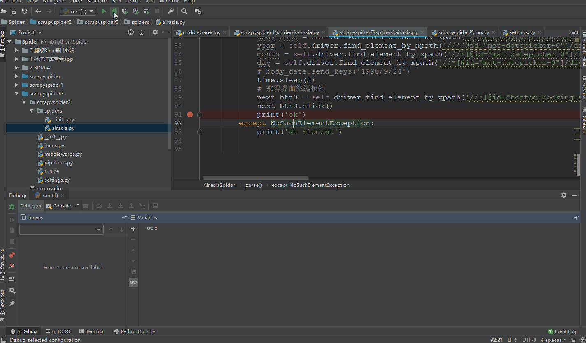

### 需求
Python-爬虫 完成以下要求
访问 https://www.airasia.com
出发地： HKG  目的地: BDO
出发时间：2019/03/20

查询数据列表后，爬取所有数据，选择最便宜的价格航班
（爬取的数据需要筛选出价格字段、日期字段、出发地、目的地，根据这些字段对比完成数据选择最便宜的航班）

选择成功后，进入旅客信息填写页，填写完成点击下一步。

### 思路：
1.采用scrapy 框架 + 破解网站js代码 爬取到对应的json文件提取数据（未采用）    
2.采用scrapy 框架 + selenium模拟浏览器 爬取网页js代码动态加载后的网站 所见即所得的方法（采用）。

### 环境：

   win10        
   pychram 2018.3

### 主要用到的Python模块：

   scrapy   
   selenium

### 注意事项：
selenium 模拟浏览器启动需要将chromedriver.exe 添加到系统环境变量路径(添加完路径需要重启电脑才能生效) 才能调用本地的谷歌浏览器   
或者直接设置webdriver.Chrome的路径参数executable_path=*/chromedriver的绝对路径         

### 运行：

1.直接在scrapyspider2/scrapyspider2/run.py 里右键点击运行即开始爬取网站信息    
2.运行scrapy命令 scrapy cawrl airasia  

运行后将需要得到的数据字段保存为test.csv 在当前文件夹下    
并通过selenium调用模拟浏览器 完成（旅客信息填写页，填写完成点击下一步）的操作

爬取过程截屏如附件 爬取过程.gif所示

    